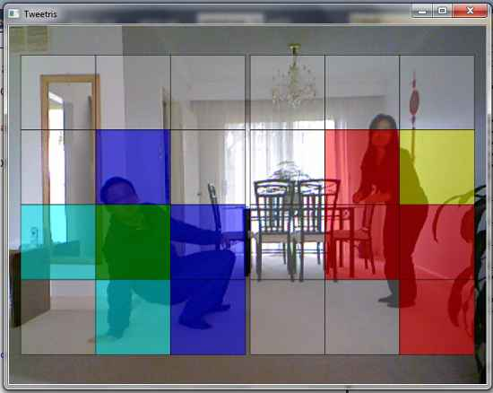
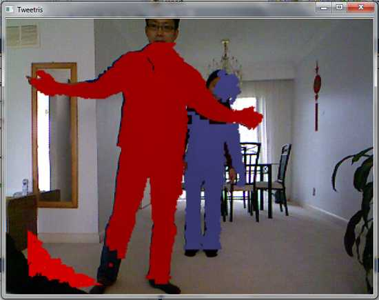

# Tweetris

This is the game where players try to make Tetris shapes with their bodies.

The goal for each player is to form the tetris shape displayed on the screen
using his or her own body. Whenever a player correctly forms the desired shape,
the program crops out the tetris shape (with the person inside) and posts it on
twitter. Then another application will download the images from twitter and
allow another player to play a tetris game with the cut-out tetris shapes.

## Screenshots

## Technologies

This game is written using C++ and Visual Studio.

It uses the following technologies:
- a Kinect to identify the positions and postures of the players
- Direct2D APIs to draw the frames
- Windows Imaging Component to encode to PNG images
- WinHTTP to upload images to Twitter

## Deployment

NOTE: that this application will only work on Windows 7.

Here are the things you need to do to change the solution file for
your own desktop.

1. open the project property page
  1. open one of the project files (e.g. tweetris.cpp)
  2. click on the "Project" menu in the menubar
  3. click on "Tweetris Properties..."

2. Additional Include Directories
  1. expand the tree to the left to
      Configuration Properties -> C/C++ -> General
  2. change "Additional Include Directories" to the location of
      your Microsoft SDK header files
      (e.g. 'Program Files\Microsoft Research KinectSDK\inc')

3. Additional Library Directories
  1. expand the tree to the left to
      Configuration Properties -> Linker -> General
  2. change "Additional Library Directories" to the location of
      your Microsoft SDK library files
      (e.g. 'Program Files\Microsoft Research KinectSDK\lib')

4. Using Precompiled Headers
   on your first compilation, you may need to compile the precompiled
   headers first
  1. expand the tree to the left to
      Configuration Properties -> C/C++ -> Precompiled Headers
  2. set "Precompiled Header" to 'Create(/Yc)'
  3. build the project
  4. set "Precompiled Header" to 'Use (/Yu)'
  5. build the project again and then run it

## Bugs and Todos

**Bug 1:**
If you run the application without connecting the Kinect, then after you close
it, the tweetris thread will still be running.
